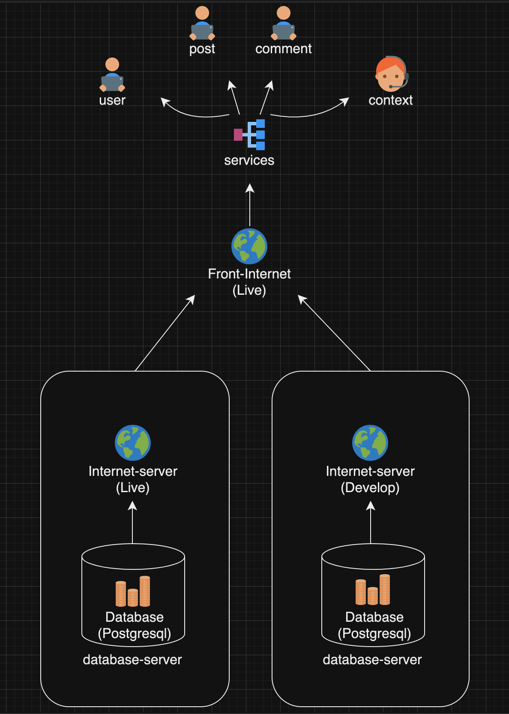

# Hands-with BE

핸즈윗은 단순히 공방 사장님들을 위한 커뮤니티를 넘어, 공방의 성장을 이끌고 공예 문화를 발전시키는 데 기여하는 플랫폼

---
<h3 align="center"> Stack </h3>
<div align="center">
<a href="https://www.djangoproject.com/">
  
</a>
<a href="https://www.python.org/">
  
</a>
<a href="https://www.postgresql.org/">
  
</a>
<a href="https://gunicorn.org/">
  
</a>
<a href="https://www.nginx.com/">
  
</a>
<a href="https://ncloud.com/">
  
</a>
</div>


<h3 align="center"> Management Tool </h3>
<div align="center">
<a href="https://www.notion.so/">
  
</a>
  <a href="https://github.com/">
    
  </a>
  <a href="https://discord.com/">
    
  </a>
</div>

---

## 프로젝트 구조

```
BE
├── config
│   ├── settings.py
│   │   ├── base.py
│   │   ├── local.py
│   │   └── production.py
│   ├── wsgi.py
│   ├── urls.py
│   └── asgi.py
│
├── users       # 사용자
│   ├── admin.py
│   ├── models.py
│   ├── serializers.py
│   ├── urls.py
│   └── views.py
│
├── posts       # 게시글
│   ├── admin.py
│   ├── models.py
│   ├── serializers.py
│   ├── urls.py
│   └── views.py
│
├── comments    # 댓글
│   ├── admin.py
│   ├── models.py
│   ├── serializers.py
│   ├── urls.py
│   └── views.py
│
├── contexts    # 문의하기
│   ├── admin.py
│   ├── models.py
│   ├── serializers.py
│   ├── urls.py
│   └── views.py
│
└── manage.py
```
